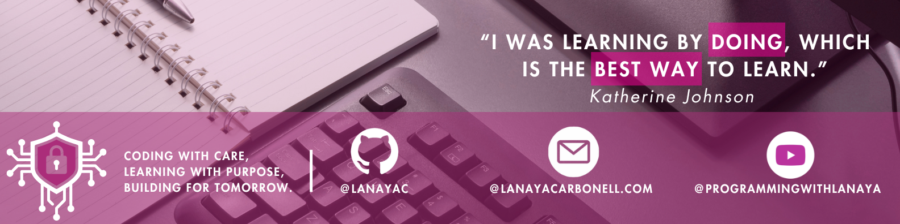

<!-- Github Views -->

<!-- Introduction -->
<h1 align="center">✩ ¡Hola! My name is Lanaya ✩ </h1>
<h3 align="center">Software Developer | Cybersecurity Enthuiast </h3>

  

 
 
### I'm a first-generation college student from NYC 
<!-- Animation Typing -->

<!-- Image Gifs -->

<!-- About Me Section -->
### About Me
- Subscribe to my YouTube Channel [ProgrammingWithLanaya](https://www.youtube.com/@ProgrammingWithLanaya)
- I’m currently working on cybersecurity and AI-related projects
- I enjoy learning something new every day
- I’m open to collaborating on research-based or impact-driven development projects
- I’m looking for support and mentorship in cybersecurity engineering
- Feel free to ask me about tech career switching, cloud security, or machine learning fundamentals
- Tip I live by: Learn by doing. Share what you build.

<!-- Skills Icon -->
## Technologies and Tools I use:

 

 

##  Let's get connected:

 
   
   
	  
	

