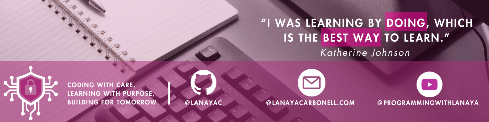

<!-- Github Views -->

<!-- Introduction -->
<h1 align="center">✩ Hi My name is Lanaya ✩ </h1>
<h3 align="center"> MS Researcher | Software Security & AI </h3>

  

 
 
### First-generation college student from NYC, now studying in Türkiye 
<!-- Animation Typing -->

<!-- Image Gifs -->

<!-- About Me Section -->
### About Me
<!--  - Subscribe to my YouTube Channel [ProgrammingWithLanaya](https://www.youtube.com/@ProgrammingWithLanaya) -->
- MS student at Bilkent University in Ankara, researching automated vulnerability repair, LLM prompt engineering, and software supply chain security
- I use empirical methods to test what actually works in software security, rather than what just sounds promising
- Open to collaborating on research and impact-driven projects
- Teaching assistant for CS courses at Bilkent University
- Working toward a career in AI governance and security compliance (GRC), connecting software security research to how organizations manage AI risk

### For My Students
Have a question about the course or an assignment? Email me at [aziza.carbonell@bilkent.edu.tr](mailto:aziza.carbonell@bilkent.edu.tr) or [book a time on my calendar](https://calendar.app.google/5kQQg79qyUBmVrHm7). No question is too small, and asking early is always better than struggling alone.
##  Let's get connected:

 
   
   
	  
	

